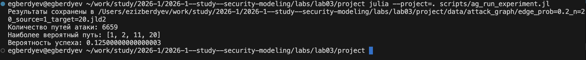
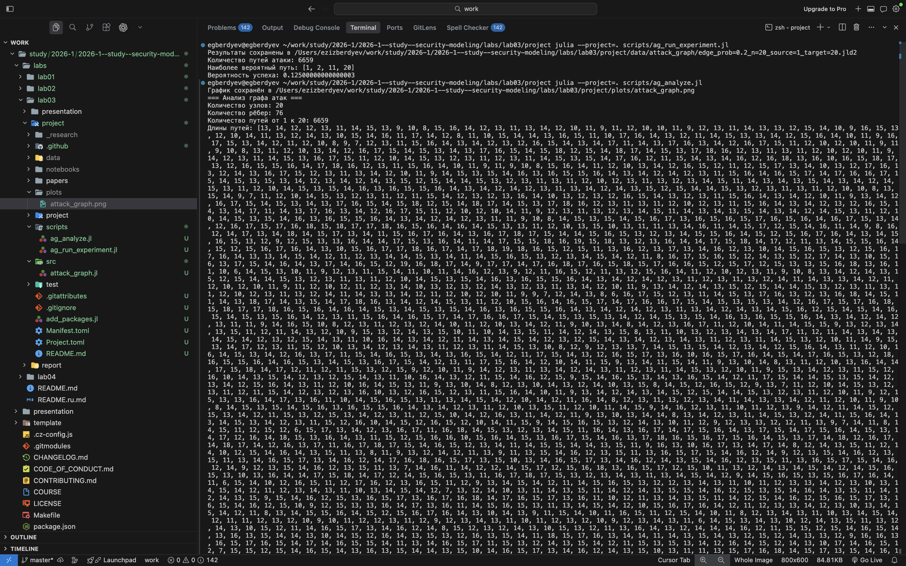
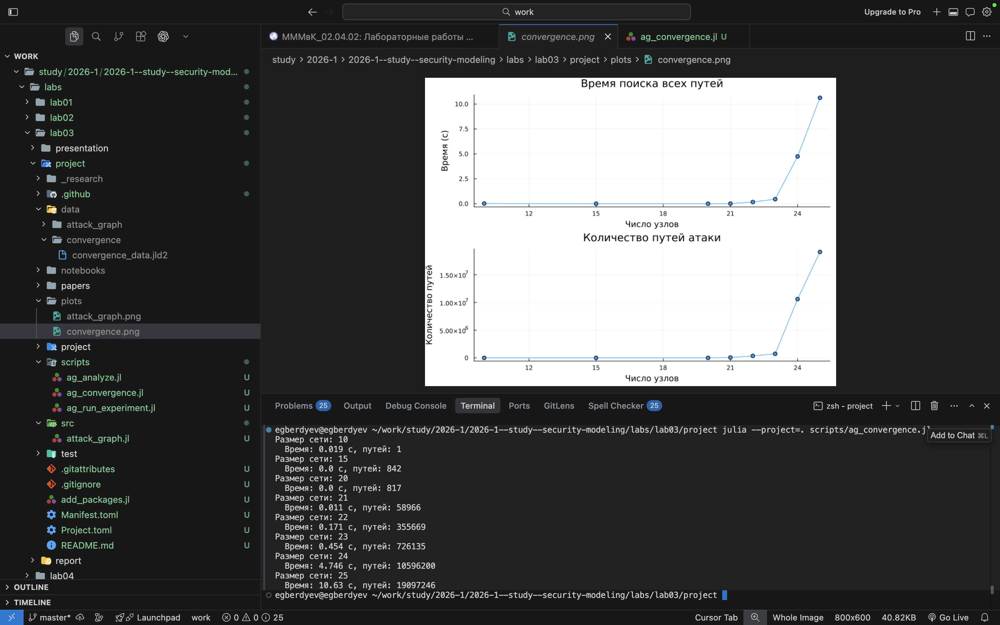

---
## Author
author:
  name: Бердыев Эзиз
  email: 1032255390@rudn.ru
  affiliation:
    - name: Российский университет дружбы народов
      country: Российская Федерация
      postal-code: 117198
      city: Москва
      address: ул. Миклухо-Маклая, д. 6

## Title
title: "Моделирование и анализ графов атак"
subtitle: "Лабораторная работа №3"
license: "CC BY"
date: today
date-format: "YYYY-MM-DD"
---

# Информация

## Докладчик

::: {.columns}

::: {.column width="70%"}

- Бердыев Эзиз
- студент
- Российский университет дружбы народов им. П. Лумумбы
- [1032255390@rudn.ru](mailto:1032255390@rudn.ru)

:::

::: {.column width="30%"}

:::

:::

# Вводная часть

## Актуальность темы

- Современные сети подвергаются постоянным кибератакам
- Необходимы формальные инструменты для анализа уязвимостей
- Граф атак — эффективная модель для оценки безопасности сети
- Позволяет выявить критические узлы и потенциальные пути проникновения

## Объект и предмет исследования

- **Объект исследования:** сетевая инфраструктура как граф уязвимостей
- **Предмет исследования:** методы построения и анализа графов атак, метрики центральности и оценка вероятности атак

## Научная новизна

- Реализация модели графа атак на языке Julia с использованием специализированных библиотек
- Совместное применение алгоритмов DFS и Дейкстры для анализа путей атаки
- Проведение параметрического исследования зависимости количества путей от плотности рёбер

## Практическая значимость работы

- Разработанная модель позволяет идентифицировать критические узлы сети
- Полученные метрики могут использоваться для расстановки приоритетов при защите инфраструктуры
- Исследование масштабируемости даёт оценку применимости модели к реальным сетям

## Цели и задачи исследования

- **Цель:** изучить методы построения и анализа графов атак для оценки уязвимостей сетевой инфраструктуры

- **Задачи:**
  - Построить граф атак для заданной сети
  - Реализовать алгоритм поиска всех путей атаки
  - Вычислить метрики центральности
  - Оценить вероятность успешной атаки
  - Визуализировать граф
  - Провести анализ масштабируемости
  - Выполнить параметрическое исследование

## Материалы, методы и инструменты

- **Язык программирования:** Julia
- **Библиотеки:** специализированные пакеты для работы с графами
- **Алгоритмы:**
  - DFS (поиск в глубину) — поиск всех путей атаки
  - Алгоритм Дейкстры — поиск наиболее вероятного пути
- **Теоретическая база:** курс РУДН по информационной безопасности [@rudn_course]

# Теоретическое введение

## Граф атак

- Граф атак — **ориентированный граф**, в котором:
  - Вершины — состояния системы (узлы сети)
  - Рёбра — возможные действия злоумышленника
- Позволяет формализовать процесс проникновения в систему
- Используется для анализа различных сценариев атак

## Метрики центральности

- **in-degree** — количество атак, направленных в узел
- **betweenness centrality** — роль узла как посредника в сети
- **closeness centrality** — близость к другим узлам
- **PageRank** — обобщённая оценка важности узла

## Вероятность атаки

- Каждому ребру назначается вероятность успешного прохождения
- Вероятность пути = произведение вероятностей всех рёбер
- Для нахождения наиболее вероятного пути:
  - Логарифмическое преобразование вероятностей
  - Применение алгоритма Дейкстры

# Содержание исследования

## Реализация графа атак

- Создание ориентированного графа с вершинами-узлами и рёбрами-атаками
- Задание доверительных отношений между узлами
- Назначение вероятностей рёбрам

{width=80%}

## Поиск путей атаки (DFS)

- Реализация алгоритма обхода графа в глубину
- Позволяет найти **все** возможные пути атаки
- Высокая вычислительная сложность при большом числе узлов

{width=80%}

## Вычисление метрик центральности

- Расчёт in-degree, betweenness centrality, closeness centrality
- Реализация алгоритма PageRank

::: {.columns}

::: {.column width="50%"}
{width=95%}
:::

::: {.column width="50%"}
{width=95%}
:::

:::

## Запуск эксперимента и результаты

::: {.columns}

::: {.column width="50%"}
{width=95%}
:::

::: {.column width="50%"}
{width=95%}
:::

:::

## Визуализация графа атак

- Граф отображается с цветовой шкалой для выделения критических узлов
- Дополнительный анализ структуры в терминале

{width=65%}

## Анализ структуры графа

::: {.columns}

::: {.column width="50%"}
{width=95%}
:::

::: {.column width="50%"}
{width=95%}
:::

:::

## Исследование масштабируемости

- Эксперимент: зависимость времени работы алгоритма от размера сети

::: {.columns}

::: {.column width="50%"}
{width=95%}
:::

::: {.column width="50%"}
{width=95%}
:::

:::

## Параметрическое исследование

- Варьирование плотности рёбер графа
- Анализ влияния на количество путей атаки и метрики

::: {.columns}

::: {.column width="50%"}
{width=95%}
:::

::: {.column width="50%"}
{width=95%}
:::

:::

# Анализ результатов

## Практическая значимость результатов

- Реализованные алгоритмы позволяют выявить критические узлы по метрикам
- Метрика betweenness centrality наиболее информативна для обнаружения посредников
- С ростом размера сети количество путей атаки резко возрастает
- При плотности рёбер свыше порогового значения анализ становится вычислительно дорогим

## Ответы на контрольные вопросы

- **Граф атак** — модель, описывающая возможные пути злоумышленника в системе
- **Алгоритмы:** DFS — поиск всех путей; Дейкстра — оптимальный путь
- **Метрики:** показывают важность узлов и роль в распространении атак
- **Вероятность:** произведение вероятностей рёбер вдоль пути
- **Ограничения:** модель упрощённая, не учитывает динамику системы
- **Расширение:** добавление механизмов защиты (фильтрация рёбер)

# Заключение

## Выводы

- Реализована модель графа атак на языке Julia
- Выполнен поиск всех путей атаки (DFS) и оптимального пути (Дейкстра)
- Рассчитаны метрики центральности: in-degree, betweenness, closeness, PageRank
- Проведена визуализация и анализ структуры графа
- Исследованы масштабируемость и влияние плотности рёбер

**Вывод:** графы атак — эффективный инструмент анализа безопасности, однако при работе с большими сетями требуют оптимизации алгоритмов.
