---
## Author
author:
  name: Бердыев Эзиз
  email: 1032255390@rudn.ru
  affiliation:
    - name: Российский университет дружбы народов
      country: Российская Федерация
      postal-code: 117198
      city: Москва
      address: ул. Миклухо-Маклая, д. 6

## Title
title: "Моделирование и анализ графов атак"
subtitle: "Лабораторная работа №3"
license: "CC BY"

bibliography: bib/cite.bib
csl: _resources/csl/gost.csl

format:
  pdf:
    toc: true
    lof: true
    lot: false
---

# Цель работы

Целью лабораторной работы является изучение методов построения и анализа графов атак для оценки уязвимостей сетевой инфраструктуры.

В рамках работы необходимо не только реализовать алгоритмы, но и глубоко понять, каким образом графовые модели позволяют формализовать процесс атаки, выявлять потенциальные уязвимости и находить критические узлы сети.

Дополнительно целью является освоение языка программирования Julia, использование специализированных библиотек для работы с графами, а также получение практического опыта проведения вычислительных экспериментов.

---

# Задание

В рамках лабораторной работы требуется:

- построить граф атак для заданной сети;
- реализовать алгоритм поиска всех путей атаки;
- вычислить метрики центральности;
- оценить вероятность успешной атаки;
- визуализировать граф;
- провести анализ масштабируемости;
- выполнить параметрическое исследование.

---

# Теоретическое введение

Граф атак представляет собой ориентированный граф, в котором вершины соответствуют состояниям системы (например, узлам сети), а рёбра — возможным действиям злоумышленника.

Такая модель позволяет формализовать процесс проникновения в систему и анализировать различные сценарии атак.

## Поиск путей атаки

Для анализа используются алгоритмы:

- **DFS (поиск в глубину)** — позволяет найти все возможные пути атаки;
- **алгоритм Дейкстры** — используется для поиска наиболее вероятного пути.

DFS особенно важен, так как позволяет выявить все потенциальные сценарии атаки, однако его вычислительная сложность может быть высокой.

## Метрики центральности

Для выявления критических узлов применяются:

- **in-degree** — показывает, сколько атак направлено в узел;
- **betweenness centrality** — отражает роль узла как посредника;
- **closeness centrality** — показывает близость к другим узлам;
- **PageRank** — оценивает важность узла в сети.

## Вероятность атаки

Если каждому ребру задать вероятность, то вероятность пути вычисляется как произведение вероятностей всех рёбер.

Для нахождения наиболее вероятного пути используется преобразование через логарифмы и алгоритм Дейкстры.

Теоретическая база работы основана на материалах курса [@rudn_course].

---

# Выполнение лабораторной работы

## Реализация графа атак

На данном этапе реализуется функция создания ориентированного графа (см. рис. @fig-1).

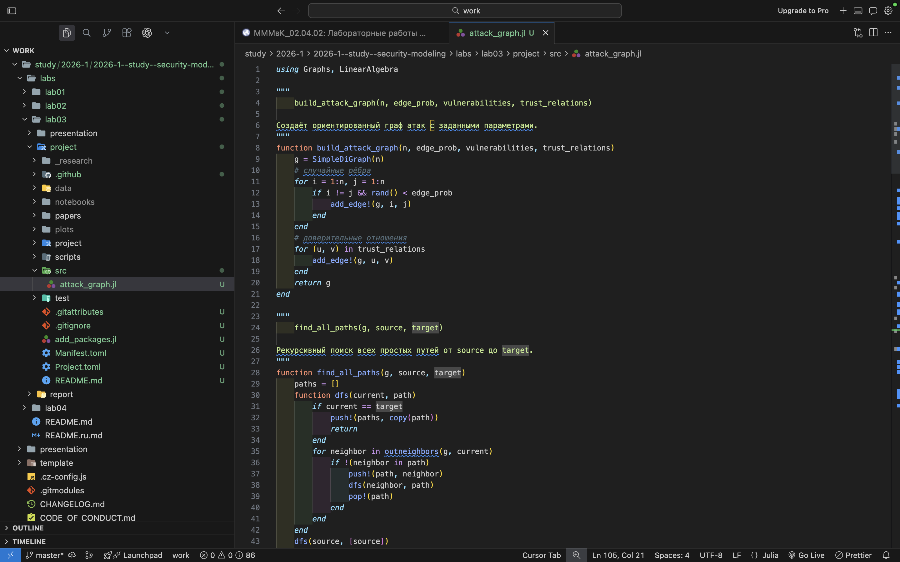{#fig-1 width=70%}

Дополнительно вводятся доверительные отношения между узлами (см. рис. @fig-2).

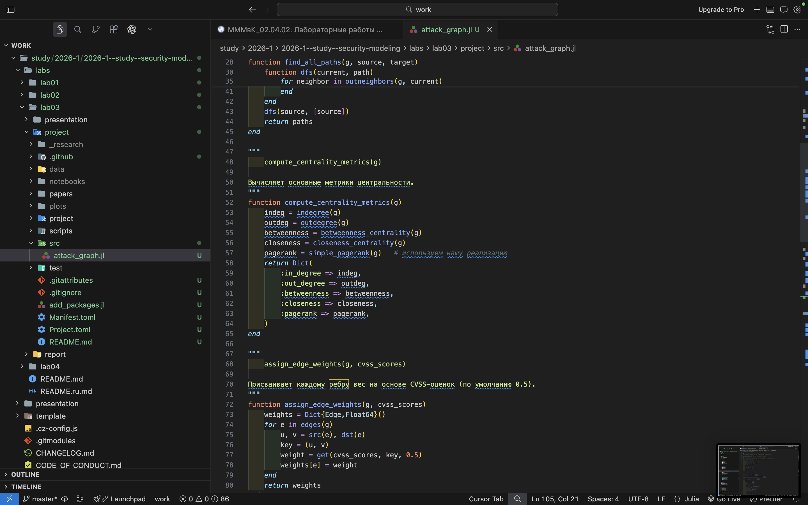{#fig-2 width=70%}

Реализован алгоритм поиска всех возможных путей атаки (см. рис. @fig-3).

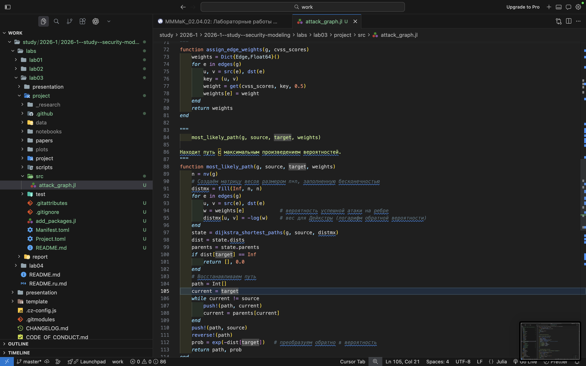{#fig-3 width=70%}

На данном этапе вычисляются метрики центральности (см. рис. @fig-4).

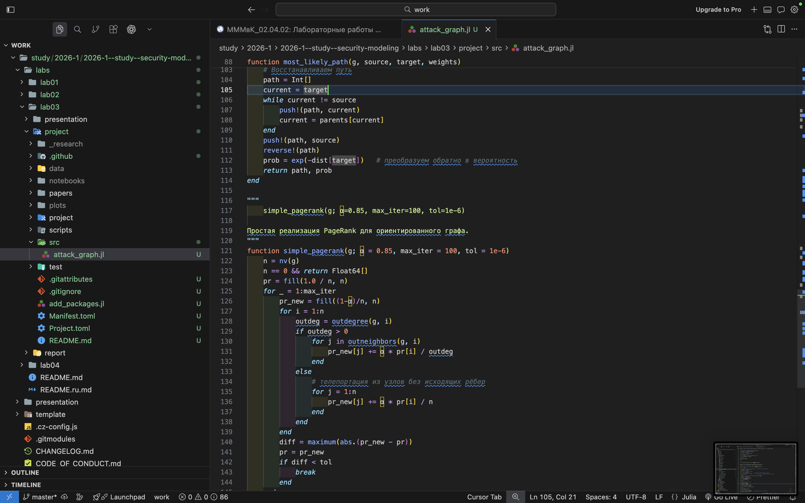{#fig-4 width=70%}

Реализуется алгоритм PageRank (см. рис. @fig-5).

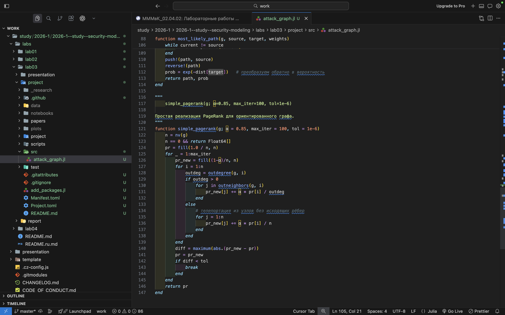{#fig-5 width=70%}

---

## Запуск эксперимента

В данном скрипте задаются параметры эксперимента (см. рис. @fig-6).

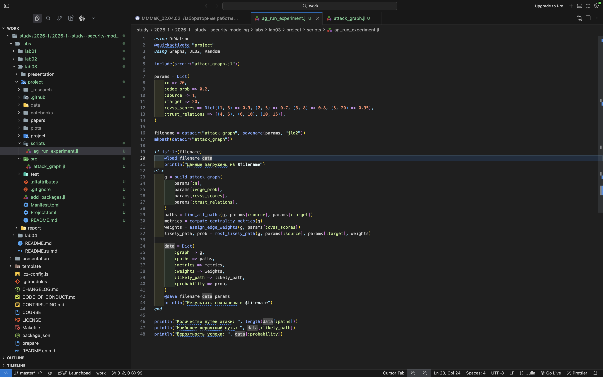{#fig-6 width=70%}

Результаты выполнения представлены ниже (см. рис. @fig-7).

{#fig-7 width=70%}

---

## Визуализация графа

Граф атак визуализируется с использованием цветовой шкалы (см. рис. @fig-8).

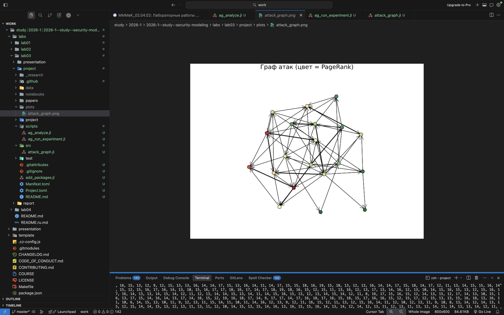{#fig-8 width=70%}

Анализ графа представлен в терминале (см. рис. @fig-9 и @fig-10).

{#fig-9 width=70%}

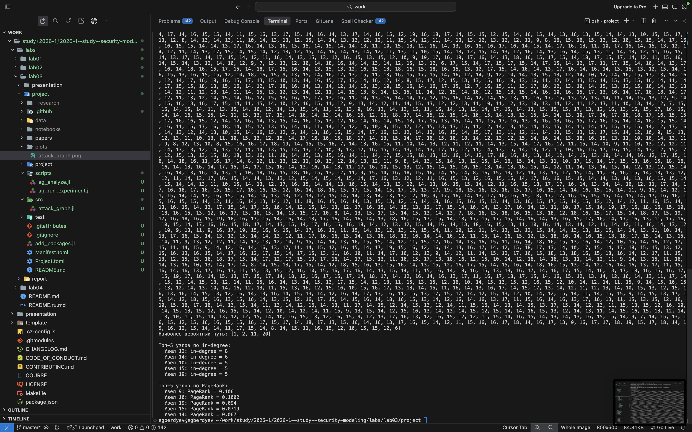{#fig-10 width=70%}

Скрипт анализа показан ниже (см. рис. @fig-11).

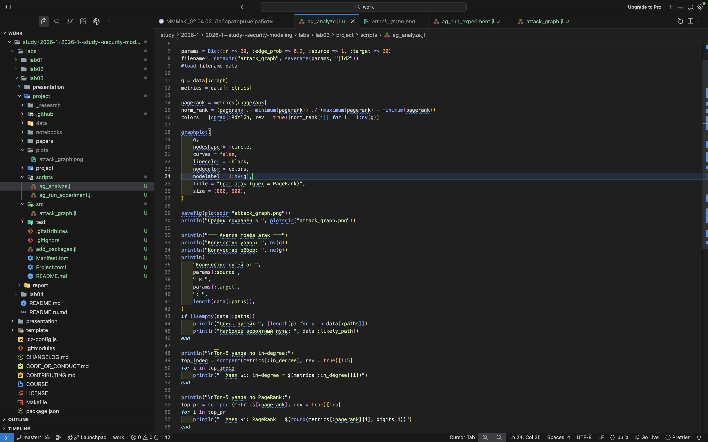{#fig-11 width=70%}

---

## Исследование масштабируемости

Проводится эксперимент зависимости времени работы от размера сети (см. рис. @fig-12).

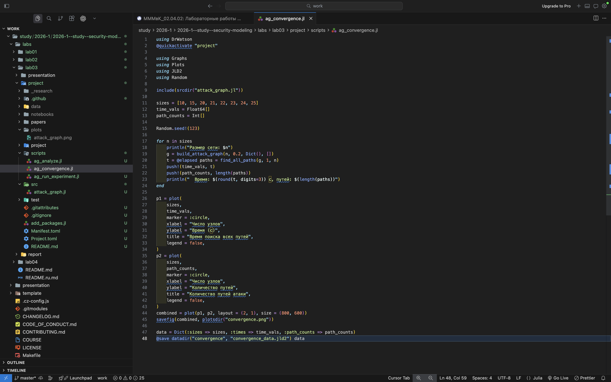{#fig-12 width=70%}

Результаты представлены ниже (см. рис. @fig-13).

{#fig-13 width=70%}

---

## Параметрическое исследование

Изменяется плотность рёбер (см. рис. @fig-14).

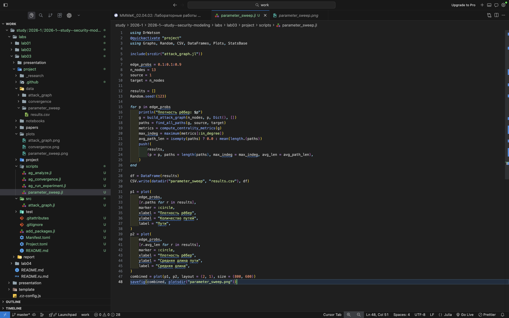{#fig-14 width=70%}

Результаты представлены ниже (см. рис. @fig-15).

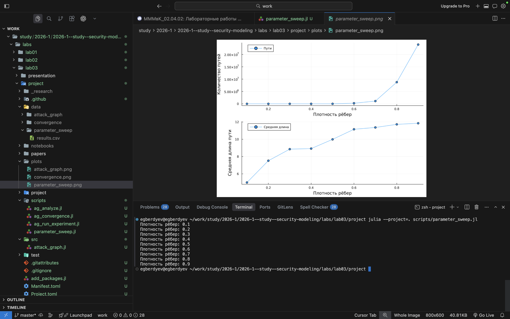{#fig-15 width=70%}

---

# Ответы на контрольные вопросы

**1. Что такое граф атак?**  
Граф атак — это модель, описывающая возможные пути злоумышленника в системе.

**2. Какие алгоритмы используются?**  
DFS для поиска всех путей и алгоритм Дейкстры для поиска оптимального пути.

**3. Что означают метрики центральности?**  
Они показывают важность узлов и их роль в распространении атак.

**4. Как оценивается вероятность атаки?**  
Как произведение вероятностей рёбер.

**5. Ограничения модели?**  
Модель является упрощённой и не учитывает динамику системы.

**6. Как расширить модель?**  
Можно добавить механизмы защиты, например, фильтрацию рёбер.

---

# Выводы

В ходе лабораторной работы была реализована модель графа атак и проведён её анализ.

Были получены следующие результаты:

- реализованы алгоритмы построения графа;
- выполнен поиск всех путей атаки;
- рассчитаны метрики центральности;
- проведена оценка вероятности атак;
- выполнена визуализация;
- проведены вычислительные эксперименты.

Анализ показал, что с увеличением размера сети резко возрастает количество возможных путей атаки, что усложняет анализ системы.

Таким образом, графы атак являются эффективным инструментом анализа безопасности, однако требуют оптимизации при работе с большими системами.

---

# Список литературы{.unnumbered}

::: {#refs}
:::
